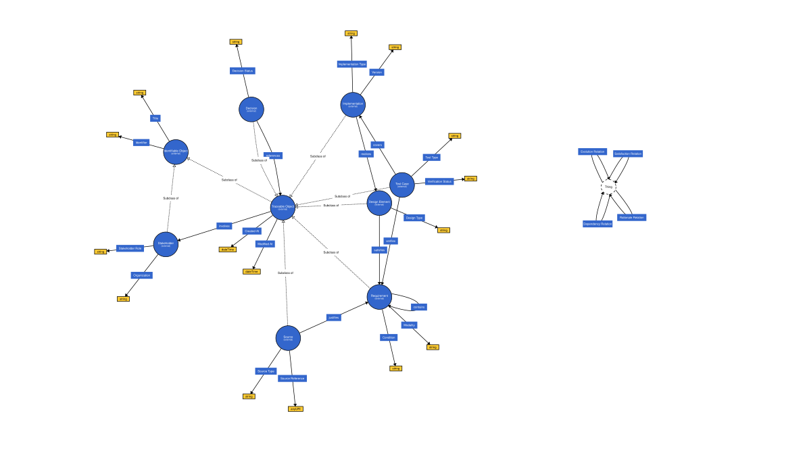

# py-traceability-rdf

A Python library providing RDF ontology definitions for object-level traceability.
The package includes a generated Turtle ontology and a Python interface to access
traceability classes and properties for pre- and post-requirement links.

## Ontology Visualization

You can visualize the ontology (TTL file) with [WebVOWL](https://service.tib.eu/webvowl/).



## Installation

```bash
pip install py_traceability_rdf
```

## Usage

```python
from py_traceability_rdf import Traceability
from rdflib import URIRef, Graph, RDF

g = Graph()
g.bind("trc", Traceability._NS)

req = URIRef("http://example.org#req_1")
design = URIRef("http://example.org#design_1")
decision = URIRef("http://example.org#decision_1")
rationale = URIRef("http://example.org#rationale_1")
source = URIRef("http://example.org#source_1")
stakeholder = URIRef("http://example.org#stakeholder_1")
test = URIRef("http://example.org#test_1")
module = URIRef("http://example.org#module_1")

g.add((req, RDF.type, Traceability.Requirement))
g.add((design, RDF.type, Traceability.DesignElement))
g.add((decision, RDF.type, Traceability.Decision))
g.add((rationale, RDF.type, Traceability.Rationale))
g.add((source, RDF.type, Traceability.Source))
g.add((stakeholder, RDF.type, Traceability.Stakeholder))
g.add((test, RDF.type, Traceability.TestCase))
g.add((module, RDF.type, Traceability.Implementation))

# Satisfaction
g.add((design, Traceability.satisfies, req))
g.add((module, Traceability.realizes, design))
g.add((test, Traceability.verifies, module))

# Rationale and provenance
g.add((decision, Traceability.isJustifiedBy, rationale))
g.add((rationale, Traceability.originatesFrom, source))
g.add((decision, Traceability.involves, stakeholder))
```

## Traceable Objects

### IdentifiableObject

Abstract base class for entities with stable identity metadata.

Datatype properties:
- `identifier` (xsd:string): Stable unique key for cross-artifact traceability. Source: [2], [3]
- `title` (xsd:string): Human-readable object title used in trace navigation. Source: [2]

### TraceableObject

Abstract base class for all traceable entities. Subclass of `IdentifiableObject`.

Datatype properties:
- `createdAt` (xsd:dateTime): Creation timestamp for lifecycle reconstruction. Source: [1], [3]
- `modifiedAt` (xsd:dateTime): Last modification timestamp for change tracking. Source: [1], [3]

### Requirement

Requirement that defines goals, constraints, or expected behavior.

Datatype properties:
- `criticality` (xsd:string): Criticality level for prioritization/compliance focus (for example `high`, `safety-critical`). Source: [2], [3]

### DesignElement

Design artifact that realizes requirements.

Datatype properties:
- `designType` (xsd:string): Design kind (for example architecture block, interface, SysML element). Source: [4]

### Implementation

Implementation artifact such as a module, class, or function.

Datatype properties:
- `implementationType` (xsd:string): Technology or realization type (for example `software`, `firmware`, `hardware`). Source: [2], [3]
- `version` (xsd:string): Version or revision identifier of the implementation artifact. Source: [3]

### TestCase

Verification artifact used to validate requirements or implementation.

Datatype properties:
- `testType` (xsd:string): Test class (unit, integration, acceptance, etc.). Source: [4]
- `verificationStatus` (xsd:string): Verification state (planned, passed, failed, blocked, etc.). Source: [3]

### Decision

Decision made during development or change management.

Datatype properties:
- `decisionStatus` (xsd:string): Decision state (proposed, accepted, rejected, deprecated). Source: [2]

### Rationale

Explanation or justification that captures why a decision was made.

Datatype properties:
- `rationaleKind` (xsd:string): Rationale category (issue, argument, assumption, alternative). Source: [2]

### Source

Source artifact such as a document, note, ticket, or standard.

Datatype properties:
- `sourceType` (xsd:string): Source category (document, standard, ticket, meeting note, etc.). Source: [2]
- `sourceReference` (xsd:anyURI): URI or external reference to the source artifact. Source: [2], [3]

### Stakeholder

Person, role, or organization responsible for creating or changing artifacts. Subclass of `IdentifiableObject`.

Datatype properties:
- `stakeholderRole` (xsd:string): Role in lifecycle activities. Source: [1], [2]
- `organization` (xsd:string): Team or organization affiliation. Source: [2]

## Object Properties

| Relation | classification [2] | Domain | Range |
| --- | --- | --- | --- |
| satisfies | Satisfaction | DesignElement | Requirement |
| verifies | Satisfaction | TestCase | Implementation |
| realizes | Dependency | Implementation | DesignElement |
| contains | Dependency | Requirement | Requirement |
| tracesTo | Rationale | Requirement | Rationale |
| isJustifiedBy | Rationale | Decision | Rationale |
| originatesFrom | - | Rationale | Source |
| involves | - | TraceableObject | Stakeholder |

## Development

### Regenerating the Ontology

```bash
python create_traceability_ontology.py
```

### Testing

```bash
python -m pytest tests/
```

### Building the Package

```bash
poetry build
```

### Publish the Package

```bash
poetry publish --username __token__ --password <TOKEN>
```

## License

[MIT](https://choosealicense.com/licenses/mit/)

## References

[1] Gotel, O. C. Z.; Finkelstein, A. C. W. (1994): An Analysis of the Requirements Traceability Problem.

[2] Ramesh, B.; Jarke, M. (2001): Toward Reference Models for Requirements Traceability.

[3] Cleland-Huang, J. et al. (2014): Software Traceability: Trends and Future Directions.

[4] Roques, P. (IREB RE Magazine): Modeling Requirements with SysML.
